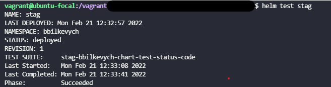
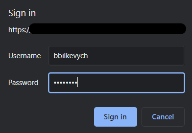

# Kubernetes Helm Chart

### How to start the helm and check the test?
- Firstly change the directory to `bbilkevych-chart`, then install the helm chart inside this directory: `helm install stag .`
- How to check the test: `helm test stag`
  As a result, you will see 'succeed', which means that website is working.

### Task:
- Created a chart template for my deployment. `helm create bbilkevych-chart`
- Modified the following pages, regarding to our needings:
  - `ingress.yaml` - set the host 
  - `service.yaml` - create a related service for ingress
  - `deployment.yaml` 
  - `issuer.yaml` - cert-manager issuer 
  - `test-status-code.yaml` - testing for my program. Curl the exit code of website.
  Tested with curl with basic-auth and without auth.
  
- Created a package, based on the Chart. `helm package <path>/`

- Modified previous ingress with hostname. The previous ingress file you can in the root of the repository.
- Ingress is integrated with our service by default.
- A `Fake LE` certificate was created with an earlier `issuer`
- Set a basic auth for my website.
  